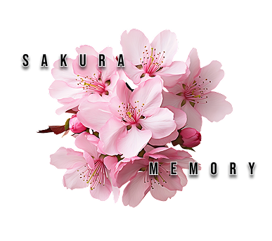

# WP-SAKURA-MEMORY 🌸

Plataforma de juegos retro con enfoque en accesibilidad y personalización. Ofrece estadísticas en tiempo real, temas visuales adaptables y una experiencia de usuario fluida.

## 🛠 Tecnologías Utilizadas
- **Frontend**: 
  - HTML5 semántico
  - CSS3 (Variables Custom, Animaciones, Flexbox/Grid)
  - JavaScript Vanilla (ES6+)
- **Metodologías**: 
  - Diseño Modular (CSS BEM-like)
  - Mobile-First Responsive
- **Herramientas**:
  - CSS Custom Properties para gestión de temas
  - Web Animations API
  - LocalStorage para persistencia de configuraciones

## 🌟 Características Clave
### 🎨 Sistema de Personalización
- **Temas Visuales**: Modos Día/Noche con transiciones suaves
- **Modos Accesibilidad**: 
  - Perfiles preconfigurados para Daltonismo (Protanopia/Deuteranopia)
  - Modo Monocromático
- **Selector de Idiomas**: ES/EN (base para i18n) (aún no implementado)

### 🚀 Experiencia de Usuario
- **Preloader Animado**: 
  - Animación de splitting horizontal
  - Logo con escala progresiva
- **Dashboard Interactivo**:
  - Carrusel de novedades con navegación por puntos
  - Gráficos circulares animados (instalaciones/jugadores online)
  - Sistema de tabs para Reviews/FAQs
- **Componentes Dinámicos**:
  - Acordeón para preguntas frecuentes
  - Dropdowns contextuales
  - Transiciones CSS optimizadas

### 📊 Módulos Especializados
- **ThemeManager.js**: Control centralizado de preferencias visuales
- **Preloader.js**: Sistema de carga con fallback de 3 segundos
- **stats.js**: Renderizado dinámico de gráficos con datos reales

## 🧠 Habilidades y Conocimientos Aplicados
- **CSS Avanzado**:
  - Animaciones keyframe (@horizontalSplit, @logoAppear)
  - Clip-path para efectos de máscara
  - Transiciones sincronizadas con delays
- **JavaScript Profesional**:
  - Patrón Module (import/export)
  - DOM Manipulation optimizada
  - Event Delegation para elementos dinámicos
- **Accesibilidad**:
  - Sistema de contraste ajustable
  - Modos de color para visión reducida
  - Semántica ARIA básica
- **Performance**:
  - Carga progresiva de recursos
  - Optimización de repaints/reflows
  - Uso eficiente de requestAnimationFrame

## 🖥 Estructura del Proyecto
WP-SAKURA-MEMORY
├── assets
│ └── icons
│ ├── Frame.png
│ └── Logo.png
├── src
│ ├── css
│ │ └── base
│ │ ├── preloader.css
│ │ ├── stats.css
│ │ ├── styles.css
│ │ └── theme-settings.css
│ ├── html
│ │ ├── stats.html
│ │ └── template.html
│ └── js
│ ├── modules
│ │ ├── Preloader.js
│ │ ├── ThemeManager.js
│ │ └── stats.js
│ ├── main.js
└── main.html

## ⚙ Instalación
1. Clonar repositorio
2. Servir via Live Server (VSCode Extension)
3. Acceder a `main.html`

> 🔨 Proyecto en desarrollo activo - Próximas features: Sistema de autenticación, API de estadísticas en tiempo real, diferentes idiomas.
